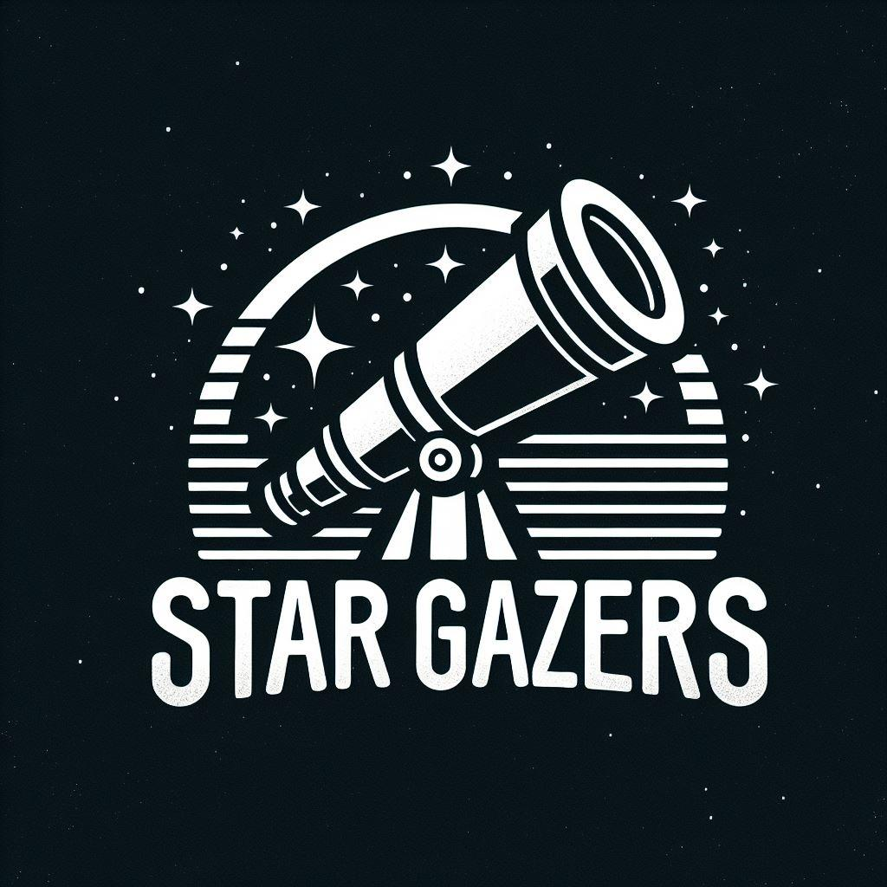
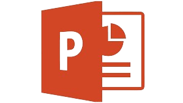

<h1 align="center"> Star Gazers </h1>

<p align="center">
    
</p>

<br>

## 🖥️ About
<p align="center">
This is our quiz game from which you can learn some interesting facts about Space. Here you're going to be asked simple quiestions about our Solar system and in the end of the quiz you can see your score. 
</p>

<hr> 

## 🛠️ Languages & Tools
### IDE and collaborative service
<p align="left">
    <a href="https://visualstudio.microsoft.com/vs/"></a>
    <a href="https://github.com/"></a>
    <a href="https://microsoft.com/bg-bg/microsoft-teams/log-in"></a>
</p>

### Documentation
<p align="left">
    <a href="https://www.microsoft.com/en-ww/microsoft-365/word"></a>
    <a href="https://www.microsoft.com/en-us/microsoft-365/powerpoint"></a>
</p>

<hr> 

## 📋 Team Members
* **Veselina Varadeva** - Front-end developer
* **Gabriela Encheva** - Scrum Trainer
* **Georgi Dimitrov** - Front-end developer
* **Kristiyana Hristova** - Back-end developer

<hr>

## ⚙ Installation
```
You can download our project by using the green "Code" button.

Or by pasting the following code in your CMD:
git clone https://github.com/GVEncheva22/Star-Gazers.git
```